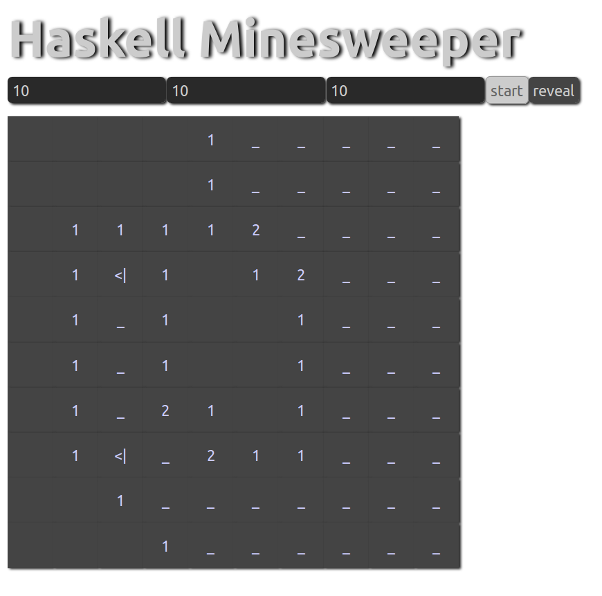

# studienarbeit-minesweeper


<h2><a href="https://ob-fun-ws18.github.io/studienarbeit-minesweeper/index.html">Documentation</a></h2>



# Build

```sh
stack build
```

# Run
```sh
stack exec studienarbeit-minesweeper-exe
```
Open http://127.0.0.1:8023 to play minesweeper (refresh to restart the game)


# Responsibilities 

Aykut Yilmaz
* Board
* Lib
* Tests
* Doku

Julian Keppeler
* Board
* Lib
* Gui
